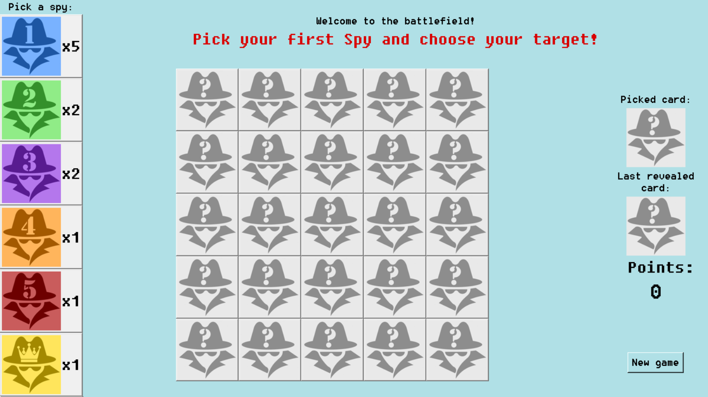
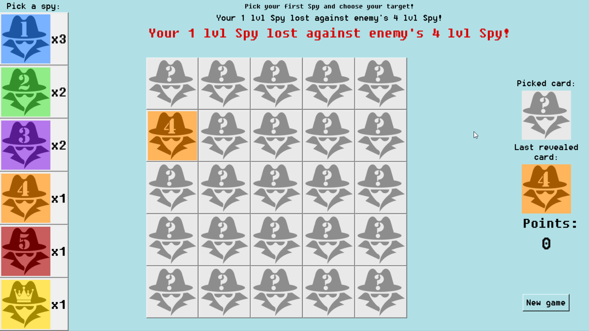
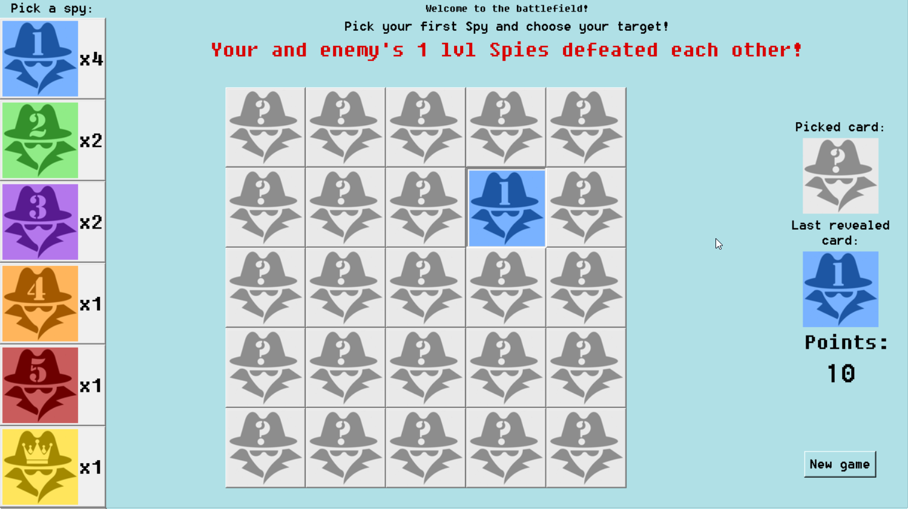
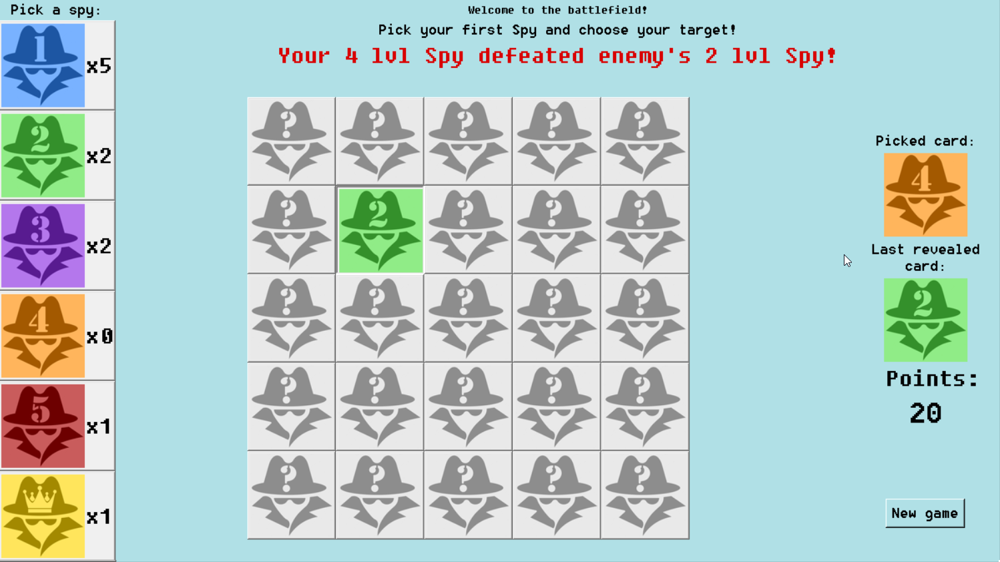
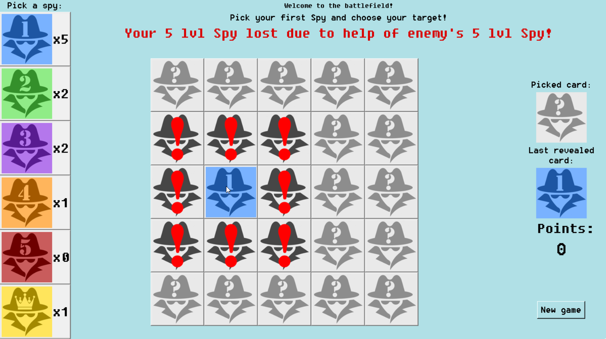
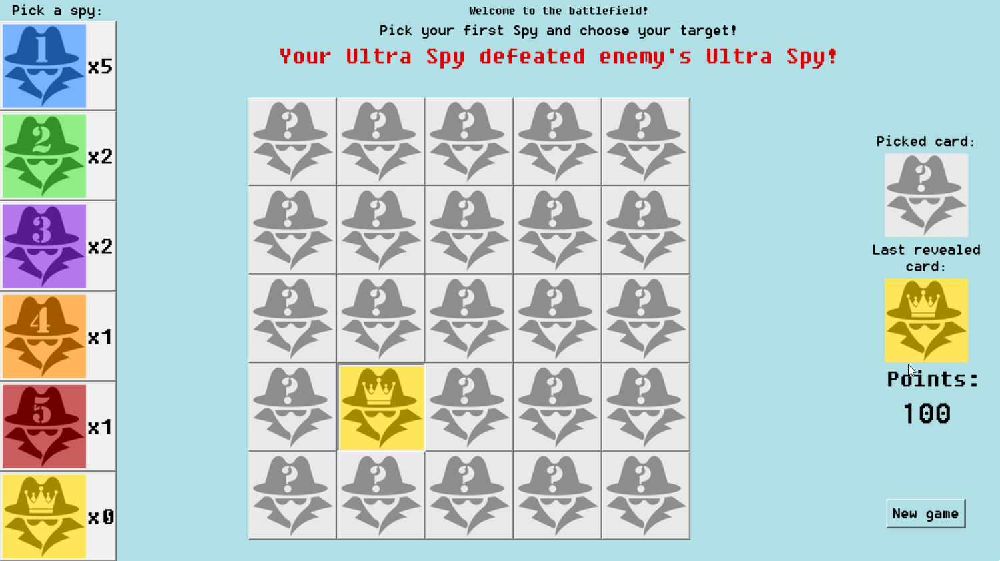
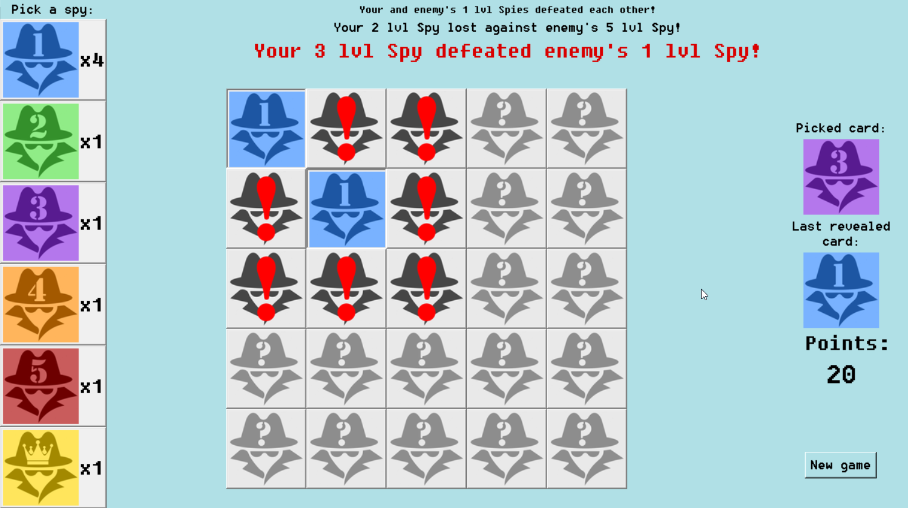
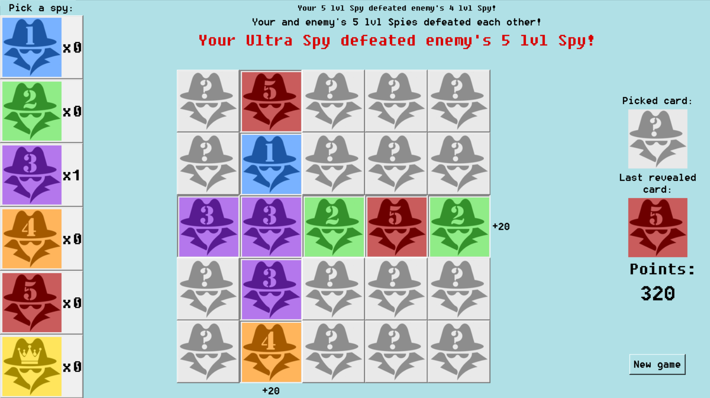

# **Find a spy**

In this game, player reveals the cards on the board with his own copies of cards. 
The higher level of the revealed card, the higher the amount of points that player gets.

The main goal is to collect as many points as possible, especially finding the Ultimate Spy for the most points.

### Technologies

- Python 3.10
- Tkinter

## Setup

To run the game, simply install it with the [executable file.](Find_the_Spy_installer.exe)

You will have Find_the_Spy.exe file in Find_the_Spy folder.

## Game

The square board consists of 25 unrevealed cards. 
The player has to choose from the left menu the Spy that will fight for him against one of the hidden enemy's Spies.

The player can unveil one of the cards from the board with a chosen Spy or pick another Spy.

There are five possible outcomes:
- Chosen Spy's level is lower than the one being revealed - 
Player loses his Spy, but knows the level of Spy on the board. Spy hides again.

- Chosen Spy's level is same as the one being revealed - 
Both spies defeat each other. Player gets revealed Spy's level * 10 points, but loses his Spy.

- Chosen Spy's level is higher than the one being revealed - 
Player gets revealed Spy's level * 10 points. He must use the same Spy again.

- If chosen Spy's level is 5 and he attacks the Spy with level from 1 to 5 - 
if the attacked Spy has a 5 level Spy in a neighbourhood (diagonally as well) 
then Player loses his 5 lv Spy, doesn't get any points and revealed card hides again.
If there is no 5 lv Spy in a neighbourhood, previous rules apply.

- The Ultimate Spy (the one with a Crown) can be used by player to defeat an enemy only once. 
He can tackle down every card, including the Ultimate Spy hidden on the board. Defeating him grants 100 points.

In every case, if a revealed card has a 5 lv Spy in a neighbourhood (diagonally as well), 
a flashing animation shows a player that information.

Player also gets +20 points for every row and column of defeated Spies.

